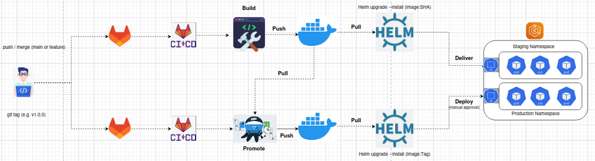
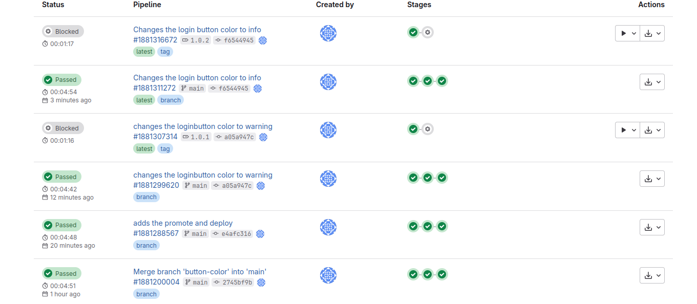
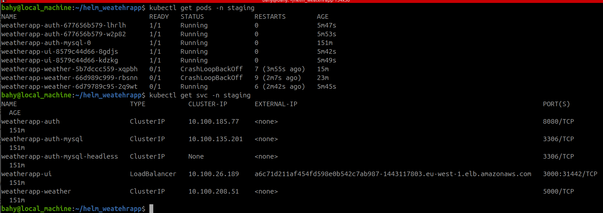

# WeatherApp CI/CD Pipeline with GitLab, Docker, Helm, and EKS

## Project Overview
This project demonstrates a complete CI/CD pipeline setup for a microservices-based WeatherApp using GitLab CI/CD, Docker, Helm charts, and AWS EKS (Elastic Kubernetes Service). The setup automates building, versioning, promoting, and deploying Docker images to Kubernetes namespaces for both staging and production environments.
## Architecture Diagram

## Tools & Technologies Used
- GitLab CI/CD for pipeline automation

- Docker for containerizing microservices

- Helm for Kubernetes application deployment

- AWS EKS as the Kubernetes cluster provider

- GitLab Docker Registry for storing Docker images

## Services in the Application
weatherapp-auth – Handles user authentication and stores credentials in MySQL

weatherapp-ui – Frontend interface served on port 3000

weatherapp-weather – Backend service to fetch weather data via an external API
## EKS Cluster Configuration
The EKS cluster was created using eksctl with the following configuration:

- apiVersion: eksctl.io/v1alpha5
- kind: ClusterConfig
- metadata:
  - name: basic-cluster
  - region: eu-west-1
- nodeGroups:
  - name: ng-1
    - instanceType: t3.large
    - desiredCapacity: 3

## GitLab CI/CD Pipeline Breakdown
The GitLab pipeline is defined in .gitlab-ci.yml and consists of 5 stages:

1. Build

Builds Docker images (without SHA tag) for all services using docker:dind. Triggered by any commit not tagged.

2. Push

Builds Docker images tagged with commit SHA and pushes them to the GitLab Container Registry. Runs only on the main branch.

3. Deliver

Uses helm upgrade --install to deploy services to the staging namespace in the EKS cluster. The Helm chart reads image SHA, API keys, and DB credentials from CI variables.

4. Promote

Triggered by pushing a Git tag (e.g., v1.0.0). It promotes the SHA-tagged Docker images by assigning them a version tag (e.g., weatherapp-ui:v1.0.0) and pushes them to the registry.

5. Deploy

Manually triggered. Uses Helm to deploy tagged images to the production namespace (default). This gives full control over which version gets deployed.

CI/CD Pipeline File

The entire .gitlab-ci.yml file is available in the repo and includes the configuration of each stage, before_script, and tagging logic.

Kubernetes Namespaces

- staging: Used by the deliver stage to test features before production.

- default (production): Used by the deploy stage to release production-ready versions.
## CI/CD in Action

✔️ A working example pipeline:

✔️ Pods & Services after a deliver:

Outputs:

- UI service is LoadBalancer (port 3000)

- Auth and Weather services are ClusterIP

## Environment Variables (GitLab CI/CD)

These variables were defined in the GitLab repository settings:

- CI_REGISTRY_USER and CI_REGISTRY_PASSWORD – for Docker login

- DB_PASSWORD – passed to weatherapp-auth Helm chart

- API_KEY – passed to weatherapp-weather chart

- K8SCONFIG – base64-encoded kubeconfig for cluster access

## Cluster Access (GitLab CI)

Each job in the deliver and deploy stages reconstructs the kubeconfig using:
- mkdir -p /tmb/.kube/config
- echo $k8sconfig | base64 -d > /tmp/.kube/config
## Features and Accomplishments

- Built and versioned microservices using GitLab pipelines

- Isolated staging and production environments using namespaces

- Tag-based image promotion for production control

- Manual deployment triggers for full release control

-  Helm-based deployment for reproducibility and rollback

## Contribution
This repository was built and maintained as part of a hands-on CI/CD project to automate Kubernetes deployments using GitLab pipelines and Helm. Contributions are welcome.
